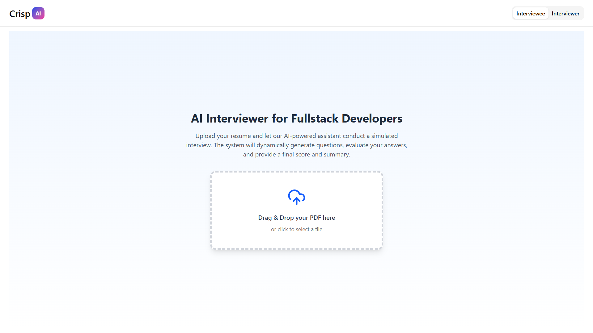
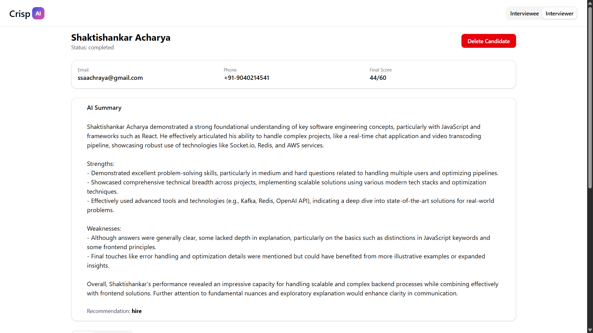

#  AI-Powered Interview Assistant (Crisp)

Simulated AI interview assistant for full-stack interviews with candidate practice and interviewer dashboard.
## Features

### Interviewee (Chat)
- Upload **PDF** or **DOCX** resumes.
- Extracts **Name, Email, Phone** from the resume.
- If fields are missing, the chatbot prompts the candidate to fill them before the interview.
- AI-driven timed interview:
  - 6 questions total (2 Easy → 2 Medium → 2 Hard).
  - Timers: Easy 20s, Medium 60s, Hard 120s.
  - Automatic answer submission when time runs out.
- Final AI score and summary generated at the end.

### Interviewer (Dashboard)
- Displays a **table of candidates** ordered by final score.
- Detailed candidate page:
  - Profile information
  - Chat history with AI questions and answers
  - AI-generated summary and scores
- Search and sort functionality.

### Persistence
- All answers, timers, and progress are stored locally using Redux + persistence.
- Refreshing or closing the page restores unfinished interviews.
- “Welcome Back” modal appears for ongoing sessions.

### Backend Routes
- `POST /api/extract` → Extract Name, Email, Phone from resume text
- `POST /api/interview/next-question` → Get the next question
- `POST /api/interview/score-answer` → Score candidate answer
- `POST /api/interview/finalize` → Finalize interview and generate summary

## Tech Stack

- **Frontend:** React, Redux (redux-persist), TypeScript
- **UI Library:** shadcn/ui
- **Backend:** Express, TypeScript
- **AI Integration:** Google Gemini API
- **Resume Parsing:** PDF/DOCX support

## Setup

### Frontend
```bash
git clone https://github.com/ssacharya2002/AI-Powered-Interview-Assistant-Crisp
cd AI-Powered-Interview-Assistant-Crisp/frontend
npm install
npm run dev
```

### Backend
```bash
cd ../backend
npm install
npm run dev
```

### Environment Variables
Create a `.env` file in the backend root with:
```
GOOGLE_GENERATIVE_AI_API_KEY=your_api_key_here
```
Create a `.env` file in the frontend root with:
```
VITE_API_URL=http://localhost:3000/api
```

## Demo

- **Live demo:** [https://ai-interviewer-crisp.netlify.app/](https://ai-interviewer-crisp.netlify.app/)
- **GitHub repository:** [https://github.com/ssacharya2002/AI-Powered-Interview-Assistant-Crisp](https://github.com/ssacharya2002/AI-Powered-Interview-Assistant-Crisp)

## Screenshots



